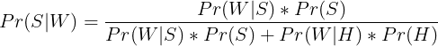
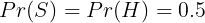
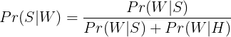

# mjolnir

## Usage

```sh
python -m mjolnir phrase_to_test_goes_here
```

Example:

```
➜ poetry run python -m mjolnir enter for a chance to win big time
0.9981053489360789
```

## Formula

The formula used is derived from Bayes' theorem:



Where:

- `Pr(S|W)` is the probability that a message is spam given that a word W is included in it
- `Pr(S)` is the overall probability that a message is spam
- `Pr(W|S)` is the probability that the word W appears in spam messages
- `Pr(H)` is this overall probability that a message is ham
- `Pr(W|H)` is the probability that the word W appears in ham messages

By assuming that the probabilities of a message being spam or ham are equal, we simplify the equation further



yields,



This is the exact equation used in the code to calculate the probability a word is spam or ham.

---

## References

[1] Data taken from the [National University of Singapore SMS Corpus](https://scholarbank.nus.edu.sg/handle/10635/137343)

[2] The [formula](https://en.wikipedia.org/wiki/Naive_Bayes_spam_filtering#Mathematical_foundation) used in the code
